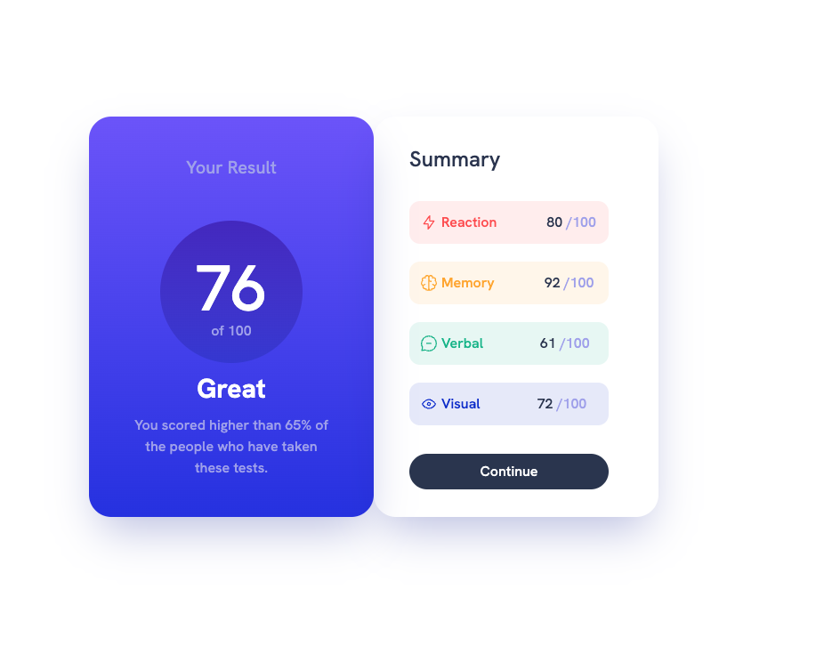
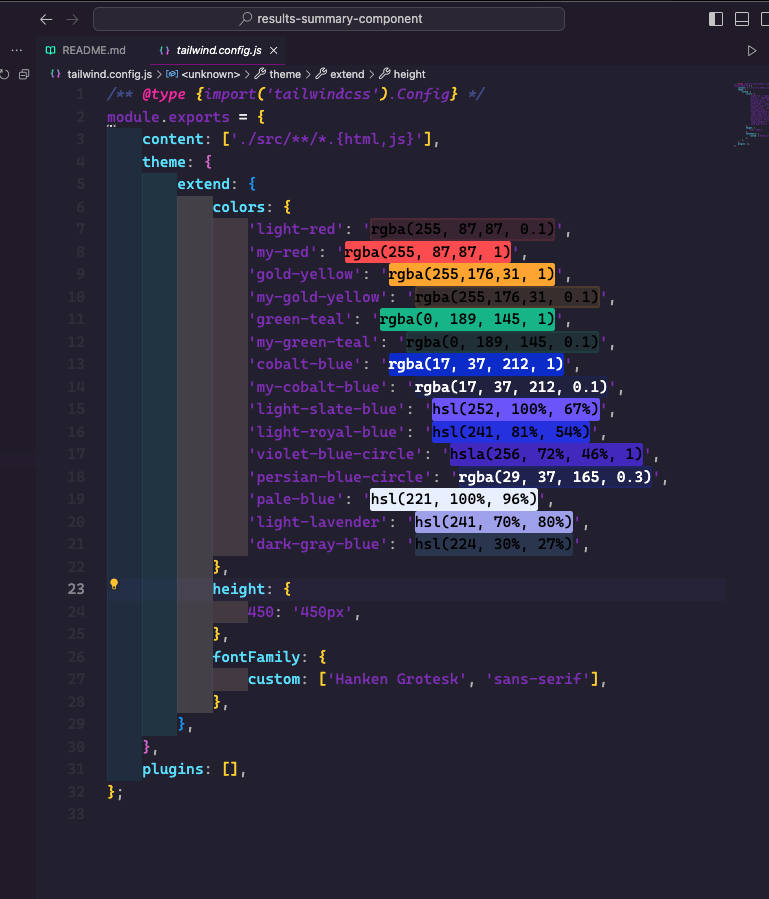

# Frontend Mentor - Results summary component solution

This is a solution to the [Results summary component challenge on Frontend Mentor](https://www.frontendmentor.io/challenges/results-summary-component-CE_K6s0maV). Frontend Mentor challenges help you improve your coding skills by building realistic projects. 

## Table of contents

- [Overview](#overview)
  - [The challenge](#the-challenge)
  - [Screenshot](#screenshot)
  - [Links](#links)
- [My process](#my-process)
  - [Built with](#built-with)
  - [What I learned](#what-i-learned)
  - [Continued development](#continued-development)
  - [Useful resources](#useful-resources)
- [Author](#author)
- [Acknowledgments](#acknowledgments)

## Overview

### The challenge
I build this component to begin my learning journey with Tailwind CSS.

### Screenshot

## My process

### Built with

- Semantic HTML5 markup
- [Tailwind CSS](https://tailwindcss.com/) - Tailwind CSS Framework

### What I learned

One of the reason I switched from Bootstrap to Tailwind CSS is the ability to cusomize my projects easily. Tailwind provides the config.js file where you can customize your heart out. 

### Continued development

I will be using Tailwind CSS in my future projects. The easy of use and the custom ability of it.

## Author

- Frontend Mentor - [@thedevbek](https://www.frontendmentor.io/profile/beksaylor)
- Twitter - [@thedevbek](https://www.twitter.com/thedevbek)

## Acknowledgments

I want to thank Frontend Mentor for providing a wonderful service for new developers. 

# results-summary-component
